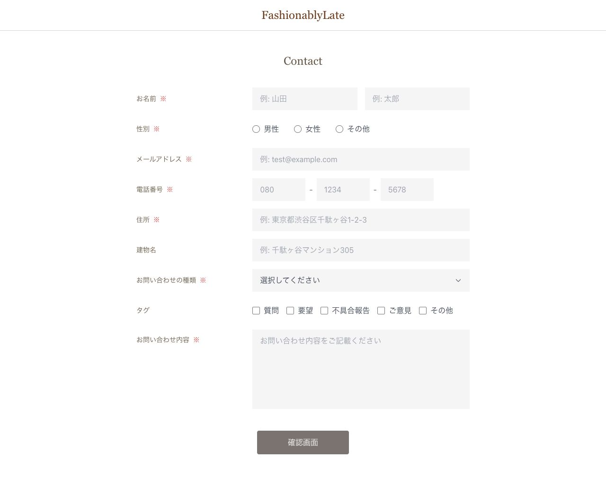
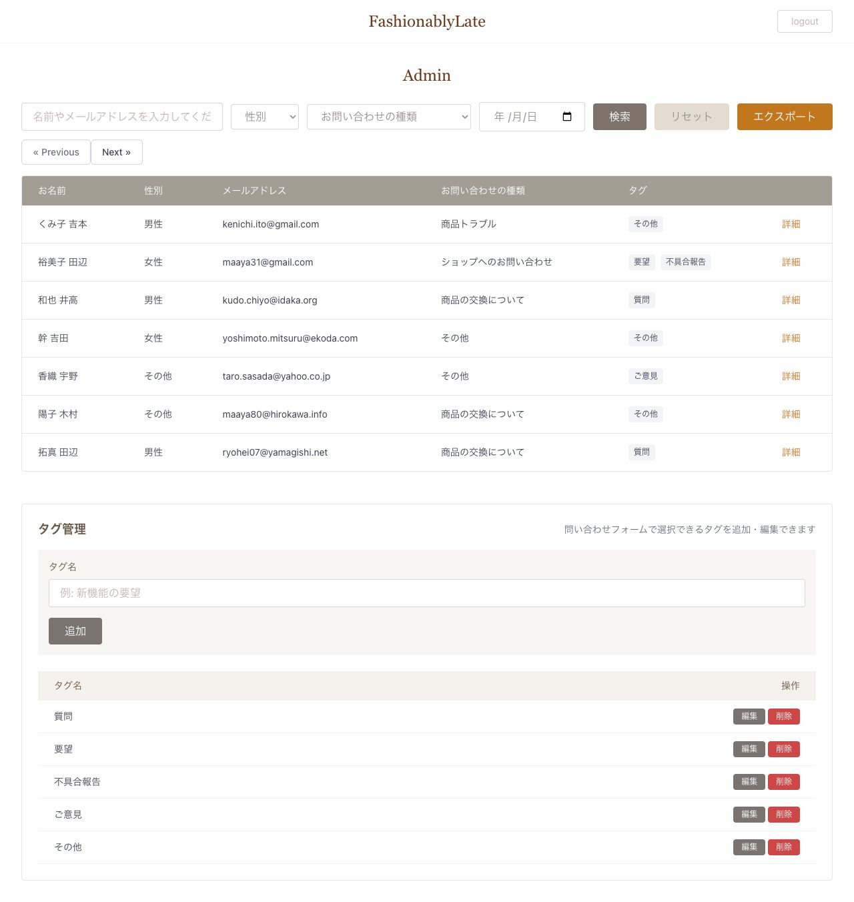

<!-- GitHub profile README for taiga-kawakubo -->

<div align="center">


[](https://github.com/taiga-kawakubo)
[](https://github.com/taiga-kawakubo?tab=followers)
[](https://github.com/taiga-kawakubo?tab=following)
[](https://github.com/taiga-kawakubo?tab=repositories)

</div>

## About

Laravel / PHPを中心に、Webアプリケーション開発を学習しています。<br />
現在は、学習の成果物として制作したお問い合わせ管理アプリを軸に、フォーム送信、認証、検索、一覧表示、削除、CSV出力など、実務でも使われる基本機能の理解と実装力を高めています。

就職・案件獲得に向けて、コードの読みやすさ、保守しやすさ、テストを意識した開発を大切にしています。

```yaml
name: Taiga Kawakubo
focus:
  - Laravel / PHP
  - Web application development
  - Admin screens and CRUD features
  - Clean code and testing
goal: "基礎を固め、実務で価値を出せるエンジニアになる"
```

## 🧰 Tech Stack

<details open>
<summary><b>Languages</b></summary>
<br />
<p>
  
  
  
</p>
</details>

<details open>
<summary><b>Frameworks & Libraries</b></summary>
<br />
<p>
  
  
  
</p>
</details>

<details open>
<summary><b>Database & Environment</b></summary>
<br />
<p>
  
  
  
  
</p>
</details>

<details open>
<summary><b>Tools</b></summary>
<br />
<p>
  
  
</p>
</details>

<details open>
<summary><b>AI & Tooling</b></summary>
<br />
<p>
  
  
</p>
</details>

## Featured Project

### Contact Form App

お問い合わせフォームと管理者画面を備えたLaravel製アプリです。<br />
ユーザーはお問い合わせを送信でき、管理者はログイン後にお問い合わせ内容の確認、検索、削除、CSV出力を行えます。

| Item | Detail |
| :--- | :--- |
| Repository | [contact-form-app](https://github.com/taiga-kawakubo/contact-form-app) |
| Purpose | 学習内容の最終段階の成果物として制作 |
| Main Features | お問い合わせ送信 / 管理者ログイン / 一覧表示 / 検索 / 削除 / CSV出力 |
| Stack | Laravel / PHP / HTML / CSS / Blade / Tailwind CSS / MySQL / Docker |
| Focus | 読みやすいコード、機能追加しやすい構成、テストを意識した実装 |

<div align="center">




</div>

## GitHub Activity

<div align="center">

<a href="https://github.com/taiga-kawakubo">
  
  
</a>

</div>

<div align="center">


</div>

## Contribution Graph

<div align="center">


</div>

## Contribution Snake

<div align="center">

<picture>
  <source media="(prefers-color-scheme: dark)" srcset="https://raw.githubusercontent.com/taiga-kawakubo/taiga-kawakubo/output/github-contribution-grid-snake-dark.svg" />
  <source media="(prefers-color-scheme: light)" srcset="https://raw.githubusercontent.com/taiga-kawakubo/taiga-kawakubo/output/github-contribution-grid-snake.svg" />
  
</picture>

</div>

## Contact

<div align="center">

[](https://github.com/taiga-kawakubo)

</div>


