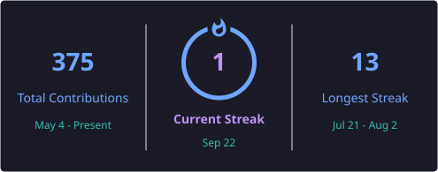

<!-- GitHub profile README for taiga-kawakubo -->

<div align="center">


[](https://github.com/taiga-kawakubo)
[](https://github.com/taiga-kawakubo?tab=followers)
[](https://github.com/taiga-kawakubo?tab=following)
[](https://github.com/taiga-kawakubo?tab=repositories)

</div>

##  About Me

Laravel / PHPを中心に、認証・認可、REST API、外部API連携、バッチ処理、通知、テストまで含めたWebアプリケーション開発に取り組んでいます。

BookShelfでは、書籍・レビュー・お気に入り・読書計画などの機能に加え、Sanctumを使用したAPI認証、Policyによる認可、Schedulerによる通知処理を実装しました。

また、ChatGPTやCodexを開発に活用するだけでなく、質問分類、学習記録、振り返り支援を行うプログラミング学習用AI Agentの設計・改善にも取り組んでいます。

```yaml
name: Taiga Kawakubo
role: Laravel / PHP Web Developer
focus:
  - Web application development
  - REST API / Authentication / Authorization / Testing
  - Learning-support AI Agent development
currently_building:
  - BookShelf
  - Programming Study AI Agent
goal: "基礎を固め、実務で価値を出せるエンジニアになる"
```

- Notionに学習ログを残し、理解したこと・詰まった点・改善点を振り返りながら学習しています。
- ChatGPT / CodexなどのAIを活用し、より良いコードや設計を考えながら実装しています。
- 学習者が自分で読み、考え、確認する力を育てられるAI Agentを開発しています。

## 🧰 Tech Stack

<details open>
<summary><b>Languages</b></summary>
<br />
<p>
  
  
  
  
</p>
</details>

<details open>
<summary><b>Frameworks & Libraries</b></summary>
<br />
<p>
  
  
  
  
</p>
</details>

<details open>
<summary><b>Database ＆ Infra</b></summary>
<br />
<p>
  
   
  
</p>
</details>


<details open>
<summary><b>Tools & AI</b></summary>
<br />
<p>
  
  
  
  
  
</p>
</details>

## 🚀 Featured Projects

### BookShelf

Laravel 10で開発した、書籍レビューと読書習慣を管理するWebアプリケーションです。<br />
書籍検索・レビュー・お気に入り・読書計画などの利用者向け機能に加え、API認証・認可、通知、日次バッチ、テストまで実装しています。

| Item | Detail |
| :--- | :--- |
| Repository | [bookshelf-app](https://github.com/taiga-kawakubo/bookshelf-app) |
| Main Features | 書籍検索・登録 / レビュー / お気に入り / いいね / 読書計画 / 通知 / ランキング |
| Backend | Fortify / Sanctum / Policy / REST API / Google Books API / Laravel Scheduler |
| Quality | Feature・Unitテスト / Laravel Pint / Route設計書 / ER図 / 画面遷移図 |
| Stack | Laravel 10 / PHP / Blade / Tailwind CSS / Alpine.js / MySQL / Docker |

### Programming Study AI Agent

Codex上で動作する、プログラミング学習を支援するAI Agentです。<br />
すぐに正解を提示するのではなく、学習者が自分でコードを読み、考え、確認する力を育てることを目的に設計しています。

| Item | Detail |
| :--- | :--- |
| Repository | [Programming-study-ai-agent](https://github.com/taiga-kawakubo/Programming-study-ai-agent) |
| Main Features | 質問分類 / 段階的な説明 / 理解確認 / Learning Case / 学習ログ / 学習傾向の整理 |
| Design | 確認範囲の制御 / 保存前の承認 / Human-in-the-loop / 継続テーマの管理 |
| Stack | Codex / Markdown / Rubyによる設定・分類ラベルの整合性検証 |

## 📊 GitHub Activity

<div align="center">



</div>

## 🐍 Contribution Snake

<div align="center">

<picture>
  <source media="(prefers-color-scheme: dark)" srcset="https://raw.githubusercontent.com/taiga-kawakubo/taiga-kawakubo/output/github-contribution-grid-snake-dark.svg" />
  <source media="(prefers-color-scheme: light)" srcset="https://raw.githubusercontent.com/taiga-kawakubo/taiga-kawakubo/output/github-contribution-grid-snake.svg" />
  
</picture>

</div>

## Contact

<div align="center">

[](https://github.com/taiga-kawakubo)
[](https://qiita.com/taiga-kawakubo)

</div>


